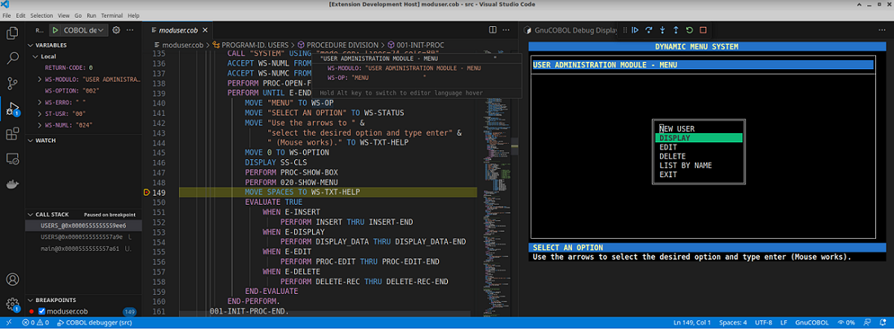

<h1 align="center">
  <br>
    
  <br>
  Debugger for <a href="https://www.gnu.org/software/gnucobol">GnuCOBOL</a>
  <br>
  <br>
</h1>

<h4 align="center">Debug COBOL code from VS Code or VSCodium.</h4>

<p align="center">
  
  
  
  
  
</p>

An extension to debug or execute GnuCOBOL code. Install from [VS Code Marketplace](https://marketplace.visualstudio.com/items?itemName=OlegKunitsyn.gnucobol-debug) or [Open VSX-Registry](https://open-vsx.org/extension/OlegKunitsyn/gnucobol-debug).

### Features
* Setting breakpoints
* Continue, Stop, Restart, Step Over, Step Into, Step Out
* Variables pane, including Copy Value, Copy as Expression and Add to Watch
* Watch pane with expressions
* Code coverage
* No mainframe required
* GnuCOBOL Docker


### Requirements
A COBOL-syntax extension i.e. `bitlang.gnucobol` (recommended, note: the previously recommended `bitlang.cobol` was split and now is intended to target MicroFocus products only), or - if you target a mainframe dialect: `broadcommfd.cobol-language-support`, `rechinformatica.rech-editor-cobol` or `ibm.zopeneditor` installed.  
Otherwise, the breakpoints will be unavailable. 

Now you may choose between *local* and *container* execution environment. Or try both of them :)

#### Local
* GnuCOBOL `cobc` 2.2+ installed.
* GNU Debugger `gdb` 6.0+ installed.

#### Container
* [GnuCOBOL Docker](https://hub.docker.com/r/olegkunitsyn/gnucobol) container up and running. 
The image includes GnuCOBOL,  GNU Debugger and all required dependencies needed to debug or execute your code. See an example below.

### Usage
When your `launch.json` config is set up, you can debug or execute your COBOL program. If you debug a Compilation Group (main- and sub- programs), you need to list sub-programs inside `group` property. Here's an example:
```json
{
    "version": "0.2.0",
    "configurations": [
        {
            "name": "COBOL debugger",
            "type": "gdb",
            "request": "launch",
            "cobcargs": ["-free", "-x"],
            "group": ["subsample.cbl", "subsubsample.cbl"]
        }
    ]
}
```

Pick `COBOL debugger` from the dropdown on the Debug pane in VS Code. Press the Play button or `F5` to debug or `Ctrl+F5` to execute.

The debugger uses C sourcecode generated by the compiler upon each debugging session. If the sourcemap isn't accurate or you see any other issues, please make a bug-report.

### Code coverage
You can estimate an execution flow of your COBOL program. 


Set `coverage` property to `true` in your `launch.json` and start debugging session. Here's an example:
```json
{
    "version": "0.2.0",
    "configurations": [
        {
            "name": "COBOL debugger",
            "type": "gdb",
            "request": "launch",
            "cobcargs": ["-free", "-x"],
            "coverage": true
        }
    ]
}
```

The extension decodes the code-coverage files in `gcov` format generated by the compiler.

### Docker
You may debug or execute your COBOL program inside [GnuCOBOL Docker](https://hub.docker.com/r/olegkunitsyn/gnucobol) container. Start the container and share your working directory by `Ctrl+Shift+P` and command `GnuCOBOL Docker: start`, or in the terminal:
```bash
docker run -d -i --name gnucobol -w ${workspaceRoot} -v ${workspaceRoot}:${workspaceRoot} olegkunitsyn/gnucobol:3.1-dev
docker exec -i gnucobol cobc -V
docker exec -i gnucobol gdb -v
```

Add `docker` property to your `launch.json` and start debugging session.
Here's an example:
```json
{
    "version": "0.2.0",
    "configurations": [
        {
            "name": "COBOL debugger",
            "type": "gdb",
            "request": "launch",
            "cobcargs": ["-free", "-x"],
            "docker": "olegkunitsyn/gnucobol:3.1-dev"
        }
    ]
}
```

Stop the container by `Ctrl+Shift+P` and command `GnuCOBOL Docker: stop`, or in the terminal:
```bash
docker rm --force gnucobol
```

### Attaching to a running process
You may debug your COBOL program attaching to a running process. In order to achieve that, you have two options:

#### Local Process
Add `pid` property to your `launch.json` and start debugging session (you can use a input variable to help like the sample below). 
Here's an example:
```json
{
    "version": "0.2.0",
    "configurations": [
        {
            "name": "COBOL debugger attach",
            "type": "gdb",
            "request": "attach",
            "cobcargs": ["-free", "-x"],
            "pid": "${input:pid}"
        }
    ],
    "inputs": [
        {
            "id": "pid",
            "type": "promptString",
            "description": "PID to attach"
        }
    ]
}
```

#### Remote Debugger (GDBServer)
Add `remoteDebugger` property to your `launch.json`. 
Here's an example:
```json
{
    "version": "0.2.0",
    "configurations": [
        {
            "name": "COBOL debugger attach",
            "type": "gdb",
            "request": "attach",
            "cobcargs": ["-free", "-x"],
            "remoteDebugger": "localhost:5555"
        }
    ]
}
```

### Displays application output in a separate window
Add `gdbtty` property to your `launch.json`. Here’s an example:
```json
{
            "name": "COBOL debugger",
            "type": "gdb",
            "request": "launch",
            "cobcargs": [
                "-free",
                "-x"
            ],
            "coverage": false,
            "gdbtty": true
}
```


* Linux Requirements: `xterm`

How to install xterm on Ubuntu: 
```
sudo apt-get install xterm
```

On Linux you can see the output of the application in Vs Code itself. Add `gdbtty` property with `vscode` value to your `launch.json`. Here is an example:
```json
{
            "name": "COBOL debugger",
            "type": "gdb",
            "request": "launch",
            "cobcargs": [
                "-free",
                "-x"
            ],
            "coverage": false,
            "gdbtty": "vscode"
}
```


### Roadmap
- Mac
- Unit testing

Your contribution is always welcome!

### Troubleshooting
Add `verbose` property to your `launch.json` and start debugging session. In `DEBUG CONSOLE` you will see complete communication log between `gdb` and VS Code. Here's an example:
```json
{
    "version": "0.2.0",
    "configurations": [
        {
            "name": "COBOL debugger",
            "type": "gdb",
            "request": "launch",
            "cobcargs": ["-free", "-x"],
            "verbose": true
        }
    ]
}
```

### Development
* Fork the repository.
* Clone it to your machine and open with VS Code.
* Install dependencies by `npm install` command in the terminal.
* Pick `Extension` from the dropdown on the Debug pane and press `F5`. This will open new VS Code instance with your cloned extension in debugging mode.
* Follow Requirements and Usage sections above.
* In the first VS Code instance you may put breakpoints to explore the functionality.
* Stop the second VS Code instance and implement your idea in TypeScript.
* Pick `Tests` from the dropdown on the Debug pane and press `F5`. Keep them green.
* Push your changes and create Pull Request to the original repository.

